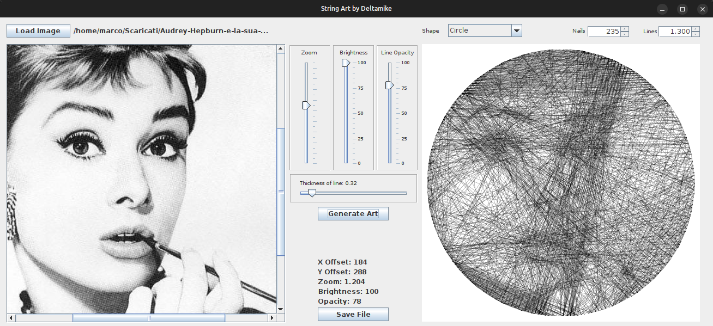
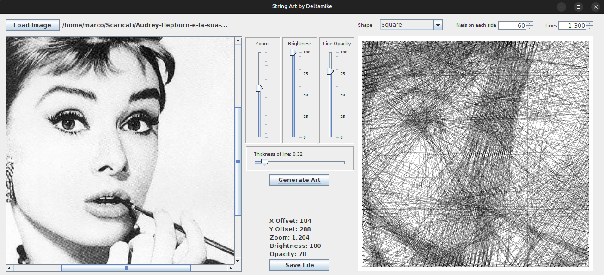
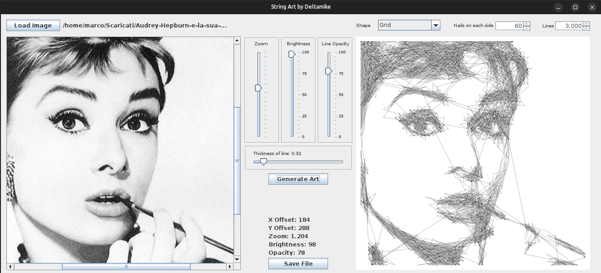

# String Art Generator

This software is a "String Art" generator. Starting from an image, a file is created with the number of nails to join to have a result similar to the original.

For Circle, the Nail "0" is in EAST Side and the numbering is clockWise

For the Square the Nail "0" is on the upper right corner and the numbering is clockwise.

For the Grid the Nail "0" is on the upper right corner and the numbering is like the writing direction

How the software works:
The algorithm used is apparently very simple. The nails are numbered starting from the number 0 in a clockwise direction, the zero nail is placed on the east side.
We start from nail 0 and draw all the lines to join the other nails, we measure, for each line, the average brightness of the pixels. The winning line is the one with the least brightness, the black line is drawn between the two nails and at the same time a white line is drawn on the original image. The destination nail of the line just drawn becomes the starting nail for the subsequent calculation, and so on until the set lines are exhausted.

How to use the software:
Nails: are the number of nails used for the calculation. My suggestion is to drive nails into the wood first and see how many you can fit, and then use that number in my software.

Lines: The number of lines used for drawing. Vary this number until you get a design that suits you.

Brightness: This is very important, it defines the color in which the line will be drawn in the original image. When I find the line with the lowest brightness, in addition to drawing the black line between the nails, I also draw a line (white if brightness = 100) to erase the line I just made. Changing this value effectively changes the brightness of the source image without actually changing it.

Line Opacity: purely aesthetic parameter to better see the result obtained.

Thickness of line: it is the thickness of the drawn line, it reflects the dimension of the thread that will be used for the execution of the work.

The generated file will contain the parameters used for the job, and the sequence of nails to join.
